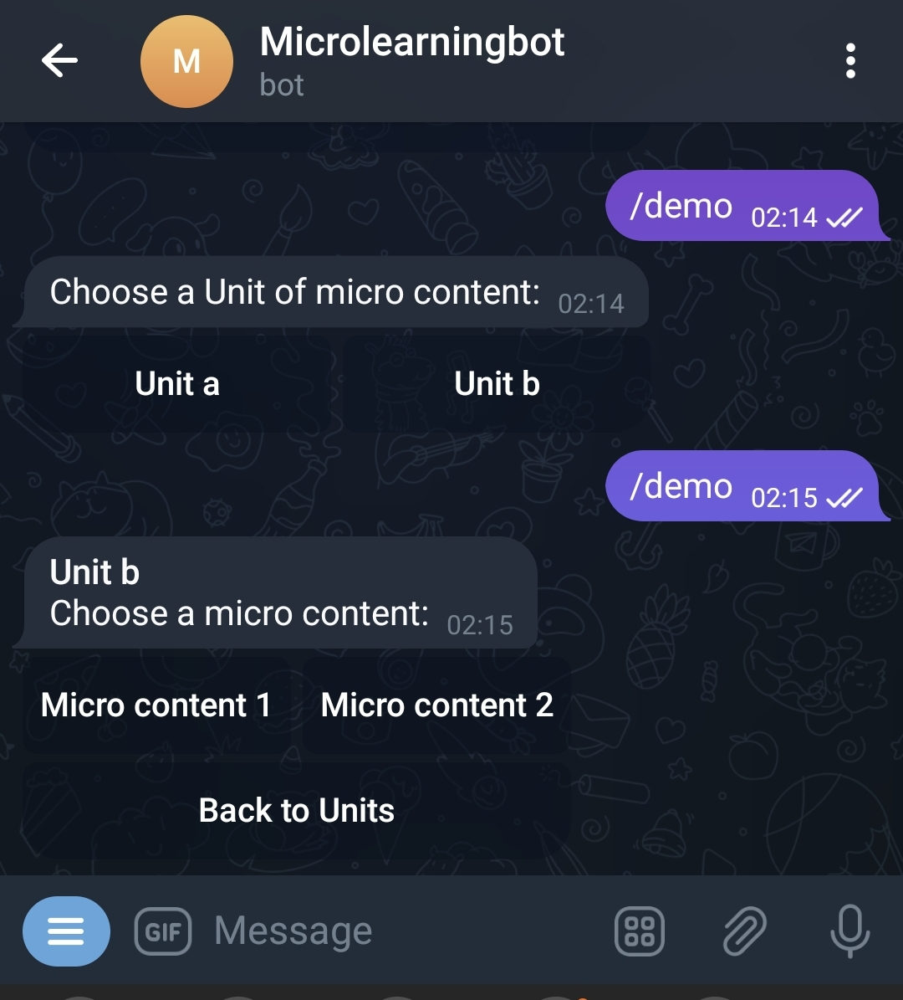
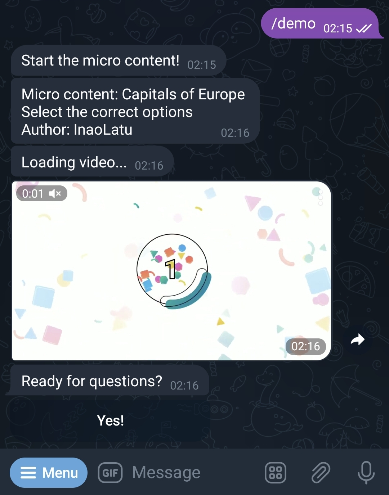
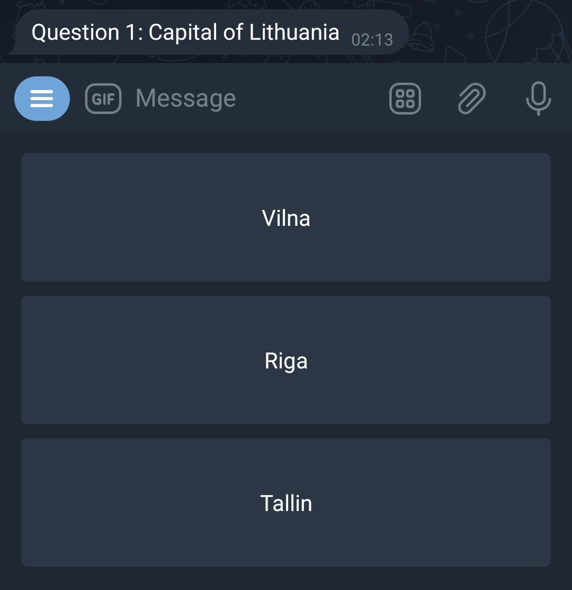
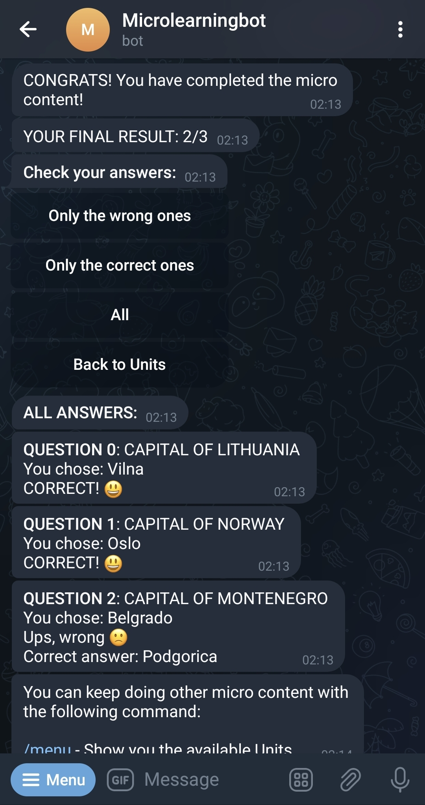

# MicroLearningBot
Piece of [MicrolearningPlatform](https://github.com/InaoLatu/MicroLearningPlatform) project.

Try @microlearningbot_bot in Telegram.

Bot built to allow the students to consume the micro-content within the different Units of knowledge (Maths, Science, etc).

It takes a micro-content in JSON format and allows to consume that micro-content so the following messages are show:

Firstly, a Menu is displayed with all the Units of micro content. The user can select the micro-content inside these Units.

Secondly, after selecting one concrete micro-content the initial information of it is shown.

Thirdly, the quiz starts and the users answers the questions, each one at a time. 

Finally, the user receives a numeric result and a feedback with the solutions and explanations for each question.

# Some pics
Initial configuration:

Starting the micro-content:

Answering a question:

Results:

